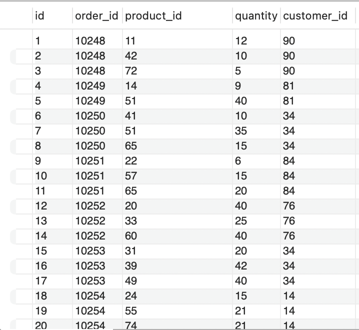
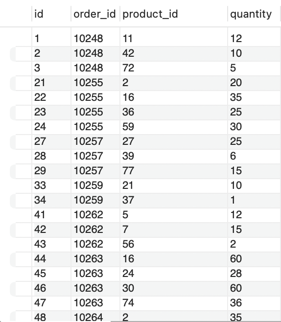
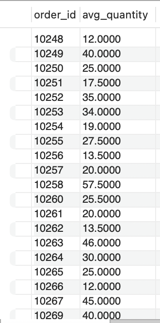
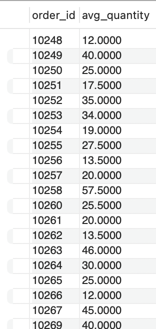
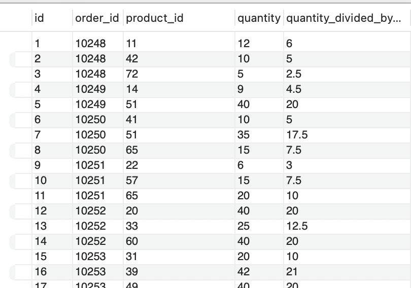

# goit-rdb-hw-05

## Завантажити базу даних

`mysql -u root -p --local-infile=1 < db.sql`

## Завдання 1

Напишіть SQL запит, який буде відображати таблицю order_details та поле customer_id з таблиці orders відповідно для кожного поля запису з таблиці order_details.

```sql
SELECT
    od.*,
    (SELECT o.customer_id FROM orders o WHERE o.id = od.order_id) AS customer_id
FROM order_details od;
```



## Завдання 2

Напишіть SQL запит, який буде відображати таблицю order_details. Відфільтруйте результати так, щоб відповідний запис із таблиці orders виконував умову shipper_id=3.

```sql
SELECT od.*
FROM order_details od
WHERE od.order_id IN (SELECT o.id FROM orders o WHERE o.shipper_id = 3);
```



## Завдання 3

Напишіть SQL запит, вкладений в операторі FROM, який буде обирати рядки з умовою quantity>10 з таблиці order_details. Для отриманих даних знайдіть середнє значення поля quantity — групувати слід за order_id.

```sql
SELECT
    order_id,
    AVG(quantity) AS avg_quantity
FROM (
    SELECT * FROM order_details WHERE quantity > 10
) AS filtered_details
GROUP BY order_id;
```



## Завдання 4

Розв'яжіть завдання 3, використовуючи оператор WITH для створення тимчасової таблиці temp.

```sql
WITH temp AS (
    SELECT * FROM order_details WHERE quantity > 10
)
SELECT
    order_id,
    AVG(quantity) AS avg_quantity
FROM temp
GROUP BY order_id;
```



## Завдання 5

Створіть функцію з двома параметрами, яка буде ділити перший параметр на другий. Обидва параметри та значення, що повертається, повинні мати тип FLOAT.

```sql
DROP FUNCTION IF EXISTS divide_floats;

DELIMITER //
CREATE FUNCTION divide_floats(a FLOAT, b FLOAT)
RETURNS FLOAT
DETERMINISTIC
BEGIN
    DECLARE result FLOAT;
    SET result = a / b;
    RETURN result;
END //
DELIMITER ;

-- Застосування функції до атрибута quantity з order_details
SELECT
    id,
    order_id,
    product_id,
    quantity,
    divide_floats(quantity, 2.0) AS quantity_divided_by_2
FROM order_details;
```


